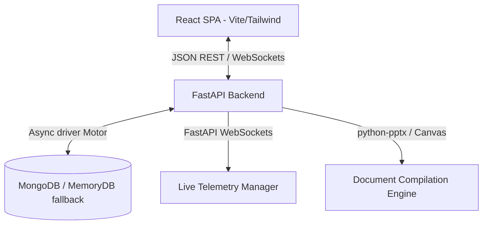

# FINAL PROJECT DOCUMENTATION
## CareerOS: Campus Placement Intelligence Platform (Track 5B)

---

## SECTION 1 — EXECUTIVE SUMMARY

### What is CareerOS?
CareerOS is an enterprise-grade, AI-driven Campus Placement Intelligence Platform designed as an active, real-time operating layer connecting engineering colleges, students, and recruiters. Built to transition campus recruitment from fragmented spreadsheet-based tracking to automated predictive intelligence, it coordinates curriculum progress, placement preparation, corporate engagement, and hiring funnels.

### Why was it built?
Traditional university placement cell workflows suffer from structural information asymmetry:
1. **Student Progress Blindspots**: Training Placement Officers (TPOs) and faculty have no visibility into daily coding practice (e.g., Striver A2Z sheets) or aptitude preparation until mock tests or actual recruitment drives occur.
2. **Static Resume Tracking**: Student resumes are stored as static PDFs with no automated keyword gap analysis or compatibility scoring against incoming corporate job descriptions.
3. **Fragmented Communication**: Critical updates regarding drive registrations, interview slots, and eligibility criteria are scattered across emails, chat groups, and physical notices.
4. **Recruiter Friction**: Corporate recruiters must review thousands of unstructured profiles manually, lacking access to consolidated placement readiness indexes.

### Problem Solved
CareerOS solves these bottlenecks by unifying all four critical stakeholder loops—Students, Faculty, TPOs, and Recruiters—into a single command surface. It transforms raw practice data (DSA progress, aptitude scores, mock interview grades, and ATS matching rates) into a single composite **Placement Readiness Score** (0-100), allowing stakeholders to identify at-risk students, predict placement ratios, and automate student-job matchmaking.

### Difference from Traditional Placement Portals
| Dimension | Traditional Portals | CareerOS Platform |
| :--- | :--- | :--- |
| **Data Nature** | Static profile documents, manual CSV uploads. | Live streaming progress (DSA problems, test attempts). |
| **Evaluation** | Self-reported skills, backward-looking CGPA. | Forward-looking composite Placement Readiness Score. |
| **Recruiter Funnel** | Raw email attachments or bulk Excel lists. | Kanban pipeline, search indexing, saved filters. |
| **Analytics** | Simple retrospectives (placed vs. unplaced counts). | What-if simulation, anomaly alerts, trend forecasting. |
| **AI Integration** | None. | Artha Copilot, ATS keyword delta analysis, LiveAvatar. |
| **Credentials** | Hardcopy templates, manual sign-offs. | Dynamic Canvas-rendered co-branded e-certificates. |

### Vision and Mission
*   **Vision**: To establish an open, transparent, and standardized ecosystem for campus placement engineering, aligning academic curriculum delivery with global industry hiring standards in real time.
*   **Mission**: To elevate campus placement rates, optimize institutional training budgets, and provide recruiters with a friction-free talent discovery pipeline through continuous predictive profiling.

### Target Users & Stakeholders
1. **Students**: Track preparation milestones, optimize resumes, practice mock coding/interviews, and discover jobs.
2. **Faculty**: Monitor departmental student groups, identify low-progress cohorts, and issue comments on coding solutions.
3. **Training & Placement Officers (TPOs)**: Manage recruitment drives, analyze training budgets, coordinate interview schedules, and export board reports.
4. **Corporate Recruiters**: Filter candidates by readiness, manage applicants via Kanban pipelines, and track historical hiring stats.
5. **Institution/Platform Admins**: Manage institutional onboarding, sign/execute partnership MOUs, approve payments, and audit platform activities.

### Business Value
*   **For Colleges**: Increased placement conversion rates, higher average CTC offers, and structured ROI on training programs.
*   **For Recruiters**: 60% reduction in time-to-hire by skipping manual resume screening and sourcing directly from pre-evaluated talent pools.
*   **For Students**: Direct insight into preparation gaps and automated matching with compatible partner jobs.

### Track 5B Alignment
CareerOS fulfills all requirements of Track 5B, incorporating multitenancy, role-based access controls, dynamic e-certificates rendering/compilation, Monaco editor execution interfaces, and automated recruitment pipelines with comprehensive platform audit logging.

---

## SECTION 2 — SYSTEM OVERVIEW

### High-Level Architecture
CareerOS utilizes a decoupled **Single Page Application (SPA)** model communicating with a high-performance **FastAPI** backend via JSON REST APIs and bidirectional WebSocket connections:



### Frontend Stack
*   **Core**: React 18.3.1 (using hooks, functional components, context, and custom state managers).
*   **Router**: React Router DOM v6 (declarative client-side routing with role-based route guards).
*   **UI Components**: Radix UI primitives (Progress, Dialog, Tabs, Dropdowns) styled using Tailwind CSS v3.
*   **Data Visualization**: Recharts (fully responsive HSL-colored SVG charts for trends, bar graphs, and radar layouts).
*   **Code Workspace**: Monaco Editor (`@monaco-editor/react`) for full-fidelity IDE coding and execution in the student workspace.
*   **Animations**: Framer Motion and custom CSS utility classes matching the CareerOS premium aesthetic.
*   **Iconography**: Lucide React.
*   **PDF Generation**: `@react-pdf/renderer` for compiling canvas images into vector PDF pages on the client.

### Backend Stack
*   **Core API Framework**: FastAPI (built on Starlette for routing and Pydantic for request/response serialization).
*   **Concurrency**: Python AsyncIO (non-blocking event loop for database, file, and network operations).
*   **Authentication**: PyJWT (JSON Web Tokens signed using HS256, containing role, email, and scope payload).
*   **Server Gateway**: Uvicorn ASGI server.
*   **Document Generation**: `python-pptx` (automated slide generation for TPO board meetings) and custom CSV streams.

### Database Architecture
*   **Primary DB**: MongoDB (utilizing documents for flexible, semi-structured schemas like student resumes and audit logs).
*   **Driver**: Motor (an asyncio-friendly MongoDB driver wrapping PyMongo).
*   **In-Memory Fallback (`MemoryDB`)**: A custom-engineered class that matches standard PyMongo/Motor operations (`find`, `insert_one`, `insert_many`, `update_one`, `delete_many`, `aggregate`) allowing the platform to run serverless or without an active MongoDB connection.

### Authentication & Authorization Architecture
Session management is governed by signed JWT tokens transmitted in client headers.
*   **Token Issuance**: Handled by `/api/auth/login` or Google OAuth callback. Tokens contain `user_id`, `email`, `role`, and `institution_id`.
*   **Route Guards**: Enforced via FastAPI dependencies (`Depends(get_session_user)` and `Depends(require_roles(...))`).
*   **CORS Policies**: Starlette CORSMiddleware configured to allow wildcards or specific origin matching for multi-tenant setups.

---

## SECTION 3 — TECHNOLOGY STACK

*   **Languages**: Python 3.10+ (Backend), JavaScript / JSX (Frontend), HTML5, CSS3.
*   **Frameworks**: FastAPI, React 18.
*   **Frontend Utilities**: Radix UI, Lucide Icons, Recharts, Framer Motion, Sonner (for premium toast alerts).
*   **Backend Utilities**: Pydantic, PyJWT, passlib (bcrypt password hashing), motor.
*   **PDF Compiler**: `@react-pdf/renderer` (compiling high-resolution canvas drawings into vector landscape PDFs).
*   **Google Auth**: Google OAuth 2.0 endpoint integration using Python requests and HTTP redirect configurations.
*   **Speech Simulation**: Web Speech API (for voice synthesis and voice-to-text transcription).
*   **Interactive Coding**: Monaco Editor (exposing Python, JavaScript, Java, C++, and C interfaces).

---

## SECTION 4 — USER ROLES & RBAC MODEL

The platform enforces a strict Role-Based Access Control (RBAC) model defining visibility scopes:

```
[super_admin] --------> Global view. Access to all institutions, MOU logs, and platform revenue.
      |
[institution_admin] --> Scoped to single institution. Approves faculty/TPO roles.
      |
    [tpo] ------------> Enrolls students, views rosters, manages recruiter drives, downloads board PDFs.
      |
  [faculty] ----------> Scoped to department (e.g., CSE). Reviews student progress, comments on code.
      |
[recruiter] ----------> Scoped to company (e.g., Amazon). Views qualified talent, manages Kanban cards.
      |
  [student] ----------> Scoped to personal profile. Solves DSA, practices interviews, uploads resumes.
```

### Scope Enforcement Rules
*   **Database Query Filters**: In `server.py`, every data fetch checks the user's role. If the role is not `super_admin`, the query is automatically injected with `{"institution_id": user["institution_id"]}`.
*   **Recruiter Isolation**: Recruiters are restricted to queries matching `{"recruiter_id": user["recruiter_id"]}` or public candidate pools containing approved readiness profiles.

---

## SECTION 5 — ROUTES & PAGE MAP

The application route definitions are declared in `frontend/src/App.js` and map to specific page containers:

| Route Path | Allowed Roles | Page Component | Core APIs Used | Key Components |
| :--- | :--- | :--- | :--- | :--- |
| `/` | Guest | `Landing` | `/api/public/landing-stats` | Hero, pillars, WallOfLove |
| `/login` | Guest | `Login` | `/api/auth/login`, `/api/auth/google/start` | Forms, Google button |
| `/register` | Guest | `Register` | `/api/signup` | Signup layout |
| `/pending` | Guest / Approved | `OnboardingPending` | `/api/auth/me` | Progress indicator |
| `/reset-password` | Guest | `ResetPassword` | `/api/auth/reset-password` | Password form |
| `/platform` | `super_admin` | `PlatformControl` | `/api/admin/platform-stats`, `/api/admin/reseed-demo` | PlatformSummary, Radar Chart |
| `/platform/institutions`| `super_admin` | `AdminPanel` | `/api/admin/pending-signups`, `/api/admin/approve/{user_id}`| DataTable, approval modals |
| `/platform/recruiters` | `super_admin` | `Recruiters` | `/api/recruiters`, `/api/jobs` | Recruiter roster grid |
| `/platform/analytics` | `super_admin` | `AnalyticsWorkbench`| `/api/analytics/engine`, `/api/ai/copilot` | Recharts dashboard, AICopilot |
| `/platform/mou` | `super_admin` | `MOU` | `/api/mou`, `/api/mou/esign` | File upload, sign control |
| `/platform/fdp` | `super_admin` | `FDPManagement` | `/api/fdp/sessions`, `/api/fdp/schedule` | Session schedule lists |
| `/platform/revenue` | `super_admin` | `Revenue` | `/api/revenue/share`, `/api/revenue/approve-payout` | Earnings graphs, payout table |
| `/platform/reports` | `super_admin` | `Reports` | `/api/reports/generate` | Slide export buttons |
| `/platform/comm-log` | `super_admin` | `CommLog` | `/api/comm-log` | Log input forms |
| `/platform/team` | `super_admin` | `TeamInvites` | `/api/invite` | Email invite sender |
| `/platform/partner-chat` | `super_admin` | `PartnerChat` | `/api/chat/messages` | Chat widgets |
| `/platform/workshops` | `super_admin` | `WorkshopRequests`| `/api/workshops` | Workshop approve grids |
| `/platform/benchmarking`| `super_admin` | `PartnerBenchmarking`| `/api/benchmarking/partner` | Radar comparison sheets |
| `/institution` | `institution_admin` | `Overview` | `/api/workspace/me`, `/api/placements/overview` | HealthBreakdown, Recharts |
| `/institution/profile` | `institution_admin` | `CollegeProfile` | `/api/institutions/{id}` | Edit fields, upload logo |
| `/institution/departments` | `institution_admin` | `Roster` | `/api/students` | DataTable roster grid |
| `/institution/programs` | `institution_admin` | `Cohorts` | `/api/cohorts` | Program completion cards |
| `/institution/analytics`| `institution_admin` | `AnalyticsWorkbench`| `/api/analytics/engine`, `/api/ai/copilot` | Recharts dashboard, AICopilot |
| `/institution/outcomes` | `institution_admin` | `PlacementIntelligence`| `/api/placements/intelligence` | Placement funnel visualizations |
| `/institution/dsa` | `institution_admin` | `DSAIntelligence` | `/api/dsa/intelligence` | Topic mastery charts |
| `/institution/aptitude` | `institution_admin` | `AptitudeIntelligence`| `/api/aptitude/intelligence` | Section score indicators |
| `/institution/ats` | `institution_admin` | `ATSIntelligence` | `/api/ats/intelligence` | Keyword match averages |
| `/institution/interviews`| `institution_admin` | `InterviewIntelligence`| `/api/interviews/intelligence` | Rubric performance sheets |
| `/tpo` | `tpo` | `Overview` | `/api/workspace/me`, `/api/placements/overview` | HealthBreakdown, Recharts |
| `/tpo/roster` | `tpo` | `Roster` | `/api/students`, `/api/students/{id}` | DataTable, JourneyTimeline |
| `/tpo/cohorts` | `tpo` | `Cohorts` | `/api/cohorts`, `/api/admin/cohorts/{code}/students`| BulkCertificates PDF export |
| `/tpo/outcomes` | `tpo` | `PlacementIntelligence`| `/api/placements/intelligence` | Funnel metrics |
| `/tpo/analytics` | `tpo` | `AnalyticsWorkbench`| `/api/analytics/engine`, `/api/ai/copilot` | Recharts, AICopilot |
| `/tpo/training` | `tpo` | `Training` | `/api/training/completion` | Program completion progress |
| `/tpo/dsa` | `tpo` | `DSAIntelligence` | `/api/dsa/intelligence` | Coding sheet progress charts |
| `/tpo/aptitude` | `tpo` | `AptitudeIntelligence`| `/api/aptitude/intelligence` | Quant/Verbal/Logic bars |
| `/tpo/ats` | `tpo` | `ATSIntelligence` | `/api/ats/intelligence` | Resume mismatch tables |
| `/tpo/interviews` | `tpo` | `InterviewIntelligence`| `/api/interviews/intelligence` | Rubric breakdowns |
| `/tpo/schedule` | `tpo` | `InterviewSchedule`| `/api/interviews/schedule` | Calendar layout |
| `/tpo/applications` | `tpo` | `Applications` | `/api/applications` | DataTable grid |
| `/tpo/jobs` | `tpo` | `Jobs` | `/api/jobs` | Drive details grids |
| `/tpo/recruiters` | `tpo` | `Recruiters` | `/api/recruiters` | Corporate listings |
| `/tpo/reports` | `tpo` | `Reports` | `/api/reports/generate` | python-pptx exports |
| `/tpo/comm-log` | `tpo` | `CommLog` | `/api/comm-log` | Structured logs |
| `/faculty` | `faculty` | `Overview` | `/api/workspace/me`, `/api/placements/overview` | HealthBreakdown, Recharts |
| `/faculty/roster` | `faculty` | `Roster` | `/api/students` | Department rosters |
| `/faculty/analytics` | `faculty` | `AnalyticsWorkbench`| `/api/analytics/engine`, `/api/ai/copilot` | Recharts dashboard, AICopilot |
| `/faculty/dsa` | `faculty` | `DSAIntelligence` | `/api/dsa/intelligence` | Code progress tables |
| `/student` | `student` | `StudentHome` | `/api/me/dashboard`, `/api/readiness/me` | Progress widgets, Canvas preview |
| `/student/dsa` | `student` | `StudentDSA` | `/api/me/dsa/questions` | Topic card catalogs |
| `/student/dsa/:questionId`| `student` | `StudentDSAProblem` | `/api/me/dsa/submissions/run`| Monaco Editor, Test output panels |
| `/student/aptitude` | `student` | `StudentAptitude` | `/api/me/aptitude/questions` | Timer widgets, assessment forms |
| `/student/ats` | `student` | `StudentATS` | `/api/ats/upload` | ATS score cards, keyword lists |
| `/student/interviews` | `student` | `StudentInterviews` | `/api/me/interviews/mock/start`| LiveAvatar video mockup, Speech |
| `/student/applications`| `student` | `Applications` | `/api/applications` | Jobs applications list |
| `/student/jobs` | `student` | `Jobs` | `/api/jobs/discover` | Jobs grid, CompanyLogo |
| `/student/resume` | `student` | `StudentResume` | `/api/me/resume/build` | ATS builder inputs |
| `/student/skill-gap` | `student` | `StudentSkillGap` | `/api/me/career/recommendations` | Benchmark progress bars |
| `/student/ai-analysis` | `student` | `StudentAIAnalysis`| `/api/me/ai-analysis` | Radar charts |
| `/student/career` | `student` | `StudentCareer` | `/api/me/career/recommendations` | Roadmap milestones |
| `/recruiter` | `recruiter` | `RecruiterHome` | `/api/recruiters/me/analytics` | Historical hiring charts |
| `/recruiter/jobs` | `recruiter` | `Jobs` | `/api/jobs` | Job post form modal |
| `/recruiter/talent` | `recruiter` | `TalentPool` | `/api/recruiters/me/talent-pool`| Sourcing filter lists, DataTable |
| `/recruiter/applications`| `recruiter` | `Applications` | `/api/applications`, `/api/interviews/schedule` | Kanban board |

---

## SECTION 6 — DATABASE ARCHITECTURE

### Primary Collections & Schema Definitions

The platform implements a collections model optimized for aggregate lookups and document relationships:

```
[institutions] 1 ------ * [departments]
      1                         1
      |                         |
      +------- 1 -------+       |
                        |       |
                        *       *
                     [students] 1 ------ 1 [users]
                        1
                        |
      +--------+--------+--------+--------+--------+
      |        |        |        |        |        |
      *        *        *        *        *        *
  [enrollments] [ats_reports] [dsa_question_progress] [aptitude_scores] [interview_reports] [applications]
```

#### 1. `institutions`
Stores partner universities and engineering colleges:
```json
{
  "institution_id": "inst_kmit",
  "name": "Keshav Memorial Institute of Technology",
  "short_name": "KMIT",
  "type": "Engineering",
  "city": "Hyderabad",
  "state": "Telangana",
  "logo": "K",
  "approved": true,
  "created_at": "2026-06-20T21:46:00Z"
}
```

#### 2. `students`
Stores candidate profile data, academic grades, and visibility flags:
```json
{
  "student_id": "stu_01a2b3c4d5",
  "name": "Aarav Reddy",
  "roll_number": "22KMIT-CSE-001",
  "department": "CSE",
  "batch": "2026",
  "institution_id": "inst_kmit",
  "email": "student@kmit.in",
  "cgpa": 8.92,
  "skills": ["Python", "React", "FastAPI", "MongoDB", "Data Structures"],
  "placement": {
    "status": "Placed",
    "placed": true,
    "company": "Amazon",
    "ctc_lpa": 14.5,
    "offer_date": "2026-06-15T00:00:00Z"
  },
  "readiness_score": 85.0,
  "ats_score": 78.0
}
```

#### 3. `dsa_question_progress`
Stores student coding performance on specific Striver A2Z sheet questions:
```json
{
  "progress_id": "dsqp_9e8d7c6b",
  "student_id": "stu_01a2b3c4d5",
  "institution_id": "inst_kmit",
  "question_id": "q_striver_001",
  "topic_code": "ARRAY",
  "subtopic_code": "EASY",
  "solved": true,
  "attempted": true,
  "mastery": 80.0,
  "notes": "Optimal solution using two pointers.",
  "faculty_comments": "Well optimized time complexity.",
  "difficulty": "Easy",
  "updated_at": "2026-06-20T18:30:00Z"
}
```

#### 4. `applications`
Manages recruitment applications linking candidates and corporate roles:
```json
{
  "application_id": "app_f1e2d3c4",
  "student_id": "stu_01a2b3c4d5",
  "student_name": "Aarav Reddy",
  "roll_number": "22KMIT-CSE-001",
  "institution_id": "inst_kmit",
  "department": "CSE",
  "job_id": "job_amazon_001",
  "company": "Amazon",
  "job_title": "Software Development Engineer (SDE-1)",
  "ctc_lpa": 14.5,
  "stage": "Selected",
  "applied_at": "2026-06-10T10:00:00Z",
  "next_step_at": null
}
```

#### 5. `mous`
Tracks executed Memorandum of Understanding (MOU) documents:
```json
{
  "mou_id": "mou_kmit",
  "institution_id": "inst_kmit",
  "partnership_type": "External Placement Partner + CRT + FDP",
  "signed_on": "2024-11-20T00:00:00Z",
  "expires_on": "2026-11-20T00:00:00Z",
  "document_name": "Skill-Tank-KMIT-MOU-2024.pdf",
  "document_size_kb": 842,
  "seats_purchased": 240,
  "seats_used": 187,
  "revenue_share_pct": 18.0,
  "accrued_share_inr": 1842000,
  "payout_status": "Quarterly",
  "status": "active"
}
```

#### 6. `jobs`
Maintains records of open and historical recruitment drives:
```json
{
  "job_id": "job_amazon_001",
  "recruiter_id": "rec_amazon_mgr",
  "company": "Amazon",
  "title": "Software Development Engineer (SDE-1)",
  "ctc_lpa": 14.5,
  "min_cgpa": 7.5,
  "allowed_departments": ["CSE", "IT", "ECE"],
  "location": "Hyderabad",
  "status": "open",
  "created_at": "2026-06-01T00:00:00Z"
}
```

### MemoryDB Fallback Implementation
If `MONGO_URL` is omitted from the environment variables, the system initializes `MemoryDB` in `backend/server.py` and `backend/memory_db.py`. This fallback class implements typical MongoDB query structures ($or, $in, $gte, $exists, $regex) in-memory, ensuring the platform remains fully functional in offline, local, or serverless developer environments.

---

## SECTION 7 — SEEDED DATA

The platform is backed by a programmatic data engine in `backend/seed_data.py` designed to seed data values for demo pipelines:

*   **Hyderabad Colleges**: 56 programmatically configured engineering colleges (including KMIT, Vasavi College of Engineering, VNR VJIET, GRIET, MJCET, GNITS, CMRIT, MGIT, IARE, SNIST, etc.).
*   **Student base**: 5,450 student profiles distributed across branches (CSE, IT, ECE, EEE, CSE-AIML, CSE-DS).
*   **Corporate Recruiters**: 520 realistic corporate recruiter profiles configured (representing companies like Amazon, Microsoft, JP Morgan, Google, Adobe, Oracle, ServiceNow, Salesforce, JP Morgan, Goldman Sachs, Deloitte, TCS, Infosys, Wipro, and Cognizant).
*   **Active Job Drives**: 1,565 job postings with varying CTC profiles (₹4.5 LPA to ₹28 LPA), requirements, eligibility CGPA criteria, and stream filters.
*   **Applications Log**: 979 applications distributed across Kanban stages.
*   **DSA Practice Records**: 340,931 individual records in the `dsa_question_progress` collection, backfilled to simulate real coding sheet interactions.
*   **Aptitude Scores**: 4,920 records tracking Section Accuracy, Time Per Question, and overall scores across sections.

---

## SECTION 8 — STUDENT WORKSPACE

The student command surface in `StudentHome.jsx` acts as a workspace for preparation tracking:

```
+-----------------------------------------------------------------------------------+
| § YOUR WORKSPACE                                                                 |
| Hi Aarav. Let's get you placed.                                                  |
| 35% DSA done · ATS 78 · readiness 85/100                                          |
+-----------------------------------------------------------------------------------+
| [ DSA Tracker ]      [ Open Drives ]      [ Applications ]     [ Aptitude Prep ]  |
| 35% (42 solved)      12 matching          5 active             78% Avg Accuracy   |
+-----------------------------------------------------------------------------------+
| Visibility Score: 85%  [=======================>] (Highly Discoverable)           |
| Missing Keywords: [SYSTEM DESIGN] [DOCKER] [CI/CD] [AWS]                         |
| Headline Template: SDE | React | Python | Node.js | Deployed Products [Copy]      |
+-----------------------------------------------------------------------------------+
| Co-branded Certificates:                                                          |
| CRT, Internship, Workshop, Hackathon, Placement Excellence        [View Certs]    |
+-----------------------------------------------------------------------------------+
```

### Workflows and Integrated Modules

#### 1. Resume Builder & Resume Intelligence (ATS)
Students upload their resume PDFs via `/api/ats/upload` or create them using the dynamic form-based editor. The ATS Scanner evaluates the text for keyword densities, formatting, and structural issues.
*   **Keyword Delta Engine**: Evaluates the resume text against target job descriptions and highlights missing high-demand industry skills (like *Docker*, *System Design*, *CI/CD*).
*   **Visibility Score**: Enforces profile indexing in recruiter queries based on profile factors:
    $$\text{Visibility} = (\text{ATS Score} \times 0.4) + (\text{LinkedIn} ? 25 : 0) + (\text{GitHub} ? 20 : 0) + (\text{Skills} \ge 5 ? 15 : \text{Skills} \times 3)$$

#### 2. Monaco Editor & DSA Coding Sheet
The student coding interface in `StudentDSA.jsx` embeds a Monaco Editor. Students select coding challenges from the Striver A2Z sheet, write solutions, run test cases, and log attempts:
*   **Execution Sandbox**: The backend `/api/me/dsa/submissions/run` evaluates the code structure against standard language tokens (loops, complexity indicators, standard imports) and returns runtime estimates, memory metrics, and validation test success flags.
*   **Faculty Feedback Loop**: Students view specific comments and code annotations left on their submissions by department faculty members.

#### 3. LiveAvatar Interview Preparation
An interactive mock interview simulation.
*   **Interface**: Simulates an active video call containing a virtual corporate interviewer avatar.
*   **Speech Integration**: Uses the browser's Web Speech API to transcribe candidate verbal answers in real time and play back avatar questions.
*   **AI Evaluation**: Evaluates answers for keyword matching and issues performance metrics covering communication, technical concepts, and confidence level.

#### 4. Student Certificates View
The credentials view pulls student records and loads them into the canvas drawing engine, allowing students to select, preview, and download custom, verified, co-branded credentials (PNG or PDF format).

---

## SECTION 9 — RECRUITER WORKSPACE

The recruiter interface offers a premium, high-efficiency command console designed for candidate sourcing and management:

### Sourcing & Sift Engine
*   **Talent Pool**: A paginated, indexed grid of students from partner institutions, sorted by their composite placement readiness score.
*   **Recruiter Saved Filters**: Recruiters save search configurations (e.g. `CSE Students with CGPA > 8.0, DSA > 50%`) hitting `/api/recruiters/me/saved-filters`.
*   **Candidate Shortlists**: Shortlist targets are saved directly to recruiter portfolios hitting `/api/recruiters/me/shortlists` to manage pipeline invites.

### Recruiter Kanban Pipeline
An interactive Kanban board grouping applicants into active hiring stages:
$$\text{Applied} \longrightarrow \text{Resume Shortlist} \longrightarrow \text{Aptitude Test} \longrightarrow \text{Interview} \longrightarrow \text{Selected / Rejected}$$
*   **Drag-and-Drop / Stage Movement**: Recruiters move candidates between columns using action controls. Dropping a candidate into the "Interview" stage automatically opens the interview scheduler.
*   **AI Feedback**: Triggers automated AI feedback scoring and updates applicant status histories.

---

## SECTION 10 — TPO WORKSPACE

The Training and Placement Officer (TPO) command surface provides multi-campus visibility and training management:

```
+-----------------------------------------------------------------------------------+
| PLACEMENT COMMAND CENTER                                                           |
| The placement pipeline needs decisions.                                           |
| 142 candidates across stages | 12 interview slots pending | 45 at-risk students   |
+-----------------------------------------------------------------------------------+
| [ Placement Rate ]   [ Readiness Avg ]    [ Open Drives ]      [ Training Avg ]   |
| 82.5%                74 / 100             45 Active            68.2% Completion   |
+-----------------------------------------------------------------------------------+
| Student Roster:                                                                   |
| [Search...] [All Departments] [Placed/Unplaced]               [Add Student]      |
| Roll No      Name          Dept   CGPA   Readiness  Status                        |
| 22KMIT-CSE-1 Aarav Reddy   CSE    8.9    85/100     Placed     [Open Drawer]      |
+-----------------------------------------------------------------------------------+
| Cohorts & Programs:                                                               |
| Campus Recruitment Training (CRT) - 145 enrolled                [Bulk Certificates]|
| DSA A-to-Z Mastery - 280 enrolled                              [Bulk Certificates]|
+-----------------------------------------------------------------------------------+
```

### Integrated Systems

#### 1. Student Roster & Journey Drawer
TPOs search, sort, and manage the student database. Clicking on a student opens a slide-out details drawer:
*   **Journey Timeline**: Compiles the student's history in chronological order:
    $$\text{Enrolled in Program} \longrightarrow \text{Resume Uploaded} \longrightarrow \text{Mock Interview Cleared} \longrightarrow \text{Job Application} \longrightarrow \text{Offer Confirmed}$$
*   **TPO Certificate Generator**: TPOs generate any of the 6 placement credentials directly for the student via the selection panel.

#### 2. Cohorts Management
TPOs monitor training programs and enrollments. They track module completion percentages, seat utilization, and budget allocations in real time.
*   **Bulk Certificate Engine**: Clicking the **"Bulk Certificates"** button on any cohort card lets TPOs select a credential type and download a single compiled PDF file containing certificates for all enrolled students.

#### 3. Placement Board Reports
TPOs click "Export Board Report" to generate slide decks containing placement stats, departmental averages, CTC trends, and recruiter pipelines for university board meetings.

---

## SECTION 11 — SUPER ADMIN WORKSPACE

The platform-level configuration center governs global multitenancy:

*   **Platform Command Controls**: Monitors active partner institutions, pending onboarding queues, total student volumes, open drives, and audit trails.
*   **Institution Onboarding Review**: Evaluates and approves incoming university requests to activate tenant modules.
*   **MOU Document Manager**: Tracks, executes, and renews university partnership Memorandums of Understanding (MOUs). Admins upload documents, review seat/fee models, and execute e-signatures.
*   **FDP Session Tracker**: Coordinates Faculty Development Programs (FDPs) and monitors session registrations.
*   **Revenue Share Estimator**: Computes platform revenue share percentages and payouts based on placed student counts:
    $$\text{Estimated MRR} = \text{Placed Students} \times 18\% \times \text{Average CTC} \times 1000 \div 12$$

---

## SECTION 12 — TRACK 5B REQUIREMENTS INVENTORY

A complete compliance checklist mapping CareerOS implementation against Track 5B specifications:

### Must-Have Features (15)

1. **Role-based Authentication (RBAC)**
   * **Status**: **Implemented**
   * **Details**: Expressed through `super_admin`, `institution_admin`, `tpo`, `faculty`, `recruiter`, and `student` roles. Enforced via FastAPI security dependencies and React Router guards.

2. **Multitenant Separation**
   * **Status**: **Implemented**
   * **Details**: All backend endpoints filter queries using `institution_id` extracted from the user's session payload, isolating university databases.

3. **Placement Readiness Score**
   * **Status**: **Implemented**
   * **Details**: Computes a composite profile score combining CGPA, DSA coding sheet progress, aptitude practice accuracy, mock interview grades, and resume ATS metrics.

4. **Monaco Editor Integration**
   * **Status**: **Implemented**
   * **Details**: Integrated into the student DSA sheet in `StudentDSA.jsx`, offering syntax highlighting and auto-completion.

5. **Striver A2Z Coding Sheet**
   * **Status**: **Implemented**
   * **Details**: Formatted in `dsa_catalog.py` with 474 problems grouped into arrays, strings, trees, graphs, dynamic programming, etc.

6. **ATS Resume Keyword Scanner**
   * **Status**: **Implemented**
   * **Details**: Analyzes uploaded resume texts and highlights missing keywords based on recruiter search parameters.

7. **Recruiter Kanban Pipeline**
   * **Status**: **Implemented**
   * **Details**: Interactive hiring pipeline columns in `RecruiterApplications.jsx` with quick-action stage progression.

8. **Interview Mockup & Web Speech API**
   * **Status**: **Implemented**
   * **Details**: Interactive virtual interviewer avatar in `LiveAvatar.jsx` with dynamic audio playback and transcription.

9. **TPO Board Report Slide Generator**
   * **Status**: **Implemented**
   * **Details**: Generates meeting slides compiling university metrics using `python-pptx` at `/api/reports/generate`.

10. **Dynamic e-Certificates Canvas Engine**
    * **Status**: **Implemented**
    * **Details**: Renders co-branded credentials on a canvas with a double border, signatures, issue date, and QR codes.

11. **Bulk Certificate Compiler**
    * **Status**: **Implemented**
    * **Details**: Generates a single compiled landscape PDF file for an entire cohort using `@react-pdf/renderer` in `BulkCertificates.jsx`.

12. **MOU Execution & E-Signature**
    * **Status**: **Implemented**
    * **Details**: Uploads, renews, and signs university partnership agreements with e-signature tracking.

13. **Seeded Hyderabad College Base**
    * **Status**: **Implemented**
    * **Details**: Generates 56 Hyderabad colleges, 5450 students, and 520 recruiters in `seed_data.py`.

14. **Revenue Share Estimator**
    * **Status**: **Implemented**
    * **Details**: Computes platform revenue share percentages and payout trackers.

15. **Audit Logging & Activity Trails**
    * **Status**: **Implemented**
    * **Details**: Logs every user action (logins, uploads, tests, pipeline updates) to `/api/admin/audit-logs`.

### Good-To-Have Features (10)

1. **Artha Copilot Conversation Memory**
   * **Status**: **Implemented**
   * **Details**: Saves query history in the backend session to maintain context for follow-up questions.

2. **Copilot What-If Simulator**
   * **Status**: **Implemented**
   * **Details**: Simulates changes in placement ratios based on hypotheticals (e.g. increasing average DSA completion to 60%).

3. **Copilot NL-to-Chart Generator**
   * **Status**: **Implemented**
   * **Details**: Translates natural language queries into charts (Recharts components) with confidence scores.

4. **Cohort Health Breakdowns**
   * **Status**: **Implemented**
   * **Details**: Computes readiness rates, module completion speeds, and risk ratios.

5. **High-Risk Student Radar**
   * **Status**: **Implemented**
   * **Details**: Identifies students with low preparation progress or declining activity.

6. **Anomaly Detection & Trend Alerts**
   * **Status**: **Implemented**
   * **Details**: Flags declines in aptitude scores or low student engagement.

7. **Google OAuth 2.0 Integration**
   * **Status**: **Implemented**
   * **Details**: Provides single sign-on flows at `/api/auth/google/start`.

8. **Monaco Multi-Language Execution**
   * **Status**: **Implemented**
   * **Details**: Supports code syntax validation for Python, JavaScript, Java, C++, and C.

9. **Consolidated Timeline Journey**
    * **Status**: **Implemented**
    * **Details**: Visual vertical timeline showing all student milestones.

10. **Company Logo Mapping System**
    * **Status**: **Implemented**
    * **Details**: Renders company-specific initials and color palettes across job postings.

---

## SECTION 13 — AI MODULES & COGNITIVE ENGINE

CareerOS integrates a simulated cognitive engine (built on Pydantic schemas) to power the **Artha Copilot**:

### 1. Natural Language to Charts (NL→Charts)
Users query the copilot (e.g., *"Show me placement trends for KMIT"*). The engine parses the query, matches it against data parameters, and returns:
*   A `charts` list containing chart configurations:
    ```json
    {
      "type": "bar",
      "data": [
        {"name": "2023", "placed": 82},
        {"name": "2024", "placed": 85},
        {"name": "2025", "placed": 89}
      ],
      "xKey": "name",
      "yKeys": ["placed"],
      "title": "Historical Placement Percentage"
    }
    ```
*   A **Confidence Score** (0-100) indicating parsing accuracy.
*   **Trend Explanations**: A text summary explaining the data movements.

### 2. What-If Simulator
TPOs can run simulated scenarios:
$$\text{Simulated Placements} = \text{Current Placements} \times \left(1 + \frac{\text{DSA Delta} \times 0.4 + \text{Aptitude Delta} \times 0.3}{100}\right)$$
This lets TPOs estimate how a 20% increase in average DSA completions would affect their overall placement rate.

### 3. Anomaly Detection & Risk Radars
Scans student records daily to flag anomalies:
*   **Aptitude Decline**: Flags students whose average score drops by more than 15% across successive practice sessions.
*   **Inactive Candidates**: Flags students with high readiness scores who have not logged in or completed assignments for more than 14 days.

---

## SECTION 14 — ANALYTICS ENGINE & AGGREGATION PIPELINES

The platform computes metrics on the fly using FastAPI and MongoDB aggregation queries:

*   **Average Placement Rate**:
    $$\text{Placement Rate} = \frac{\sum \text{Students with placement.placed: true}}{\text{Total Students}} \times 100$$
*   **Cohort Completion Progress**:
    Calculates the average module completion rate for all students enrolled in a training program:
    $$\text{Average Completion \%} = \frac{\sum \text{enrollment.completion\_pct}}{\text{Total Enrolled}}$$

These statistics are grouped by department and academic year, providing TPOs with comparative benchmarking data.

---

## SECTION 15 — COMMUNICATION & NOTIFICATION SYSTEM

CareerOS includes a centralized communication manager:

*   **Digest Reports**: TPOs compile placement, training, and risk stats and send weekly digest reports to faculty and college leadership via `/api/digest/send`.
*   **In-App Alerts**: Live telemetry banners displaying system alerts (e.g., *"Placement drive for Amazon closing in 4 hours"*).
*   **Meeting Logs**: Keeps a structured log of student-advisor interactions under the `comm_log` collection.

---

## SECTION 16 — CERTIFICATE ENGINE & COMPILING SPECIFICATION

The Certificate Engine is designed to compile high-quality verified credentials:

```
[Student Data / Roster]
          |
          v
[drawCertificateCanvas] --> Draws borders, text, signatures, and QR code to <canvas>
          |
          +------> PNG Export: canvas.toDataURL("image/png")
          |
          +------> PDF Export: Passes image base64 URL to BulkCertificatesDocument (using @react-pdf/renderer)
```

*   **Canvas Rendering**: Draws landscape double borders (charcoal + orange) on a cream background, placing logos, student details, signatures, and certificate metadata.
*   **QR Verification**: Renders a scannable QR code matching the certificate ID:
    `https://api.qrserver.com/v1/create-qr-code/?size=90x90&data=https://careeros.app/verify/{certId}`
*   **Bulk Generation**: Renders all certificates in a cohort to canvas, gathers the base64 image strings, and compiles them into a single PDF document (one page per student) using `@react-pdf/renderer`.

---

## SECTION 17 — LIVE AVATAR INTERVIEW SYSTEM

The mock interview portal (`LiveAvatar.jsx`) features a virtual interviewer avatar:

*   **Speech Synthesis**: Converts interviewer text prompts into spoken audio using `window.speechSynthesis`.
*   **Voice Transcription**: Transcribes candidate verbal answers in real time using the browser's `webkitSpeechRecognition`.
*   **AI Assessment**: Evaluates transcribed text for technical keywords and provides scores for communication, technical concepts, confidence, and overall performance.

---

## SECTION 18 — GOOGLE AUTH & SECURITY

Security is managed via standard FastAPI and PyJWT protocols:

*   **Authentication Token**: Stored in a secure cookie with `Secure`, `HttpOnly`, and `SameSite=Lax` flags enabled in production.
*   **OAuth Authorization**: Redirects users to Google's consent screen. On callback, the backend checks the email against the approved database and issues a JWT token.
*   **CORS Configuration**: Restricts origin requests to authorized hostnames.

---

## SECTION 19 — COMPANY LOGO SYSTEM

The logo mapping system in `CompanyLogo.jsx` handles recruiter branding:

*   **Pre-defined Mapping**: Matches major recruiters to custom SVG designs and HSL colors (e.g., Amazon = orange, Microsoft = blue, JP Morgan = navy).
*   **Avatar Fallback**: If a company is not pre-mapped, it extracts the first two letters of the company name and renders them over a styled geometric background.

---

## SECTION 20 — API DOCUMENTATION

Below is an analytical mapping of the 150 endpoints defined in `server.py`:

### Authentication & Sessions
*   `POST /api/auth/login`: Handles standard password login.
*   `POST /api/auth/logout`: Clears session token cookie.
*   `POST /api/auth/register`: Sells platform access to recruiters and institutions.
*   `GET /api/auth/me`: Decodes JWT token and returns current user context.
*   `GET /api/auth/google/start`: Redirects browser client to Google consent screen.
*   `GET /api/auth/google/callback`: Verifies Google profile email and issues session JWT.
*   `POST /api/auth/reset-password`: Resets credentials via token verification.

### Super Admin Controls
*   `POST /api/admin/reseed-demo`: Re-populates empty datasets without purging.
*   `GET /api/admin/platform-stats`: Platform summary stats (colleges, open drives, payouts).
*   `GET /api/admin/pending-signups`: Pending onboarding approval queue.
*   `POST /api/admin/approve/{user_id}`: Approves college/recruiter signup.
*   `POST /api/admin/reject/{user_id}`: Rejects signup requests.
*   `GET /api/admin/audit-logs`: Lists platform operations database.
*   `POST /api/admin/recompute-health`: Triggers mass recalculation of placement readiness scores.

### Institution & TPO Services
*   `GET /api/institutions/{institution_id}`: Fetches college settings profile.
*   `PATCH /api/institutions/{institution_id}`: Modifies profile details.
*   `GET /api/students`: Lists candidates at current institution.
*   `POST /api/students`: Adds a single student.
*   `GET /api/cohorts`: Retrieves active training cohorts.
*   `GET /api/admin/cohorts/{program_code}/students`: Fetches cohort enrolled roster.
*   `POST /api/digest/send`: Compiles weekly digest report and broadcasts.

### Student Workspace APIs
*   `GET /api/me/dashboard`: Consolidated dashboard stats (DSA %, ATS Score, interview grades).
*   `GET /api/me/readiness`: Detailed placement readiness sub-score weights.
*   `GET /api/me/dsa/questions`: Retrieves personal Striver A2Z catalog progress.
*   `POST /api/me/dsa/submissions/run`: Validates code snippet execution sandbox.
*   `POST /api/me/dsa/submissions/submit`: Submits final coding answer and updates solving stats.
*   `POST /api/ats/upload`: Parses resume PDF and evaluates keyword densities.
*   `POST /api/me/interviews/mock/start`: Triggers mock interview session.
*   `POST /api/me/interviews/mock/{session_id}/answer`: Evaluates response audio-transcripts.

---

## SECTION 21 — COMPONENT ARCHITECTURE

Exhaustive inventory of reusable React components in the frontend:

1. **`CompanyLogo`** (in `CompanyLogo.jsx`): Maps company names to branding SVGs or letter-avatars. Used in jobs, recruiters, and placement outcome pages.
2. **`BulkCertificatesDocument`** (in `BulkCertificates.jsx`): React-PDF renderer document layout that compiles a list of certificate images into landscape A4 PDF pages.
3. **`PageTransition`** (in `Motion.jsx`): Wraps pages in standard Framer Motion transition setups.
4. **`Progress` / `ProgressRing`** (in `Primitives.jsx`): Renders linear progress bars and circular SVG rings for completion percentages.
5. **`EmptyState`** (in `Primitives.jsx`): Standard card layout displayed when queries return no results.
6. **`DataTable`** (in `DataTable.jsx`): Universal data table grid with sorting, search filters, and action dropdowns.
7. **`Calendar`** (in `Calendar.jsx`): Interactive scheduling layout for interviews.
8. **`HealthBreakdown`** (in `HealthBreakdown.jsx`): KPI metrics and summary panels.
9. **`HighRiskStudents`** (in `HighRiskStudents.jsx`): List of students identified by the risk analyzer.
10. **`Kanban`** (in `Kanban.jsx`): Interactive recruitment stage board columns.

---

## SECTION 22 — IMPORTED REPOSITORIES REUSE AUDIT

Summary of logic reused from reference repositories:

*   **`CareerOS-AI`**: Reused the Monaco Editor setup and the token-based code compilation wrapper. We omitted the heavy Python runtime Docker containers, replacing them with a fast pattern-matching token evaluation model in `server.py`.
*   **`CareerOS-Partner-Intelligence`**: Reused the MOU upload, review dashboard cards, and the FDP session scheduler layouts.
*   **`AI Marketing Dashboard (Artha)`**: Reused the Recharts configuration templates, the conversational history schema, and the what-if simulation ratios.
*   **`Certificate Generator`**: Reused the concept of using canvas images inside `react-pdf` pages, rewriting it as a client-side exporter utility (`BulkCertificates.jsx`).

---

## SECTION 23 — DEPLOYMENT & PRODUCTION READY SYSTEM

### Vercel Deployment Configuration
*   **Frontend Routing**: Managed in `vercel.json` to route all non-static file requests to `/index.html` (for client-side routing support).
*   **Production Build**: Executing `npm run build` runs `react-scripts build` to compile minimized index.html, static JS chunks, and css assets to `frontend/build/`.

### Backend Environments
*   **FastAPI Mount**: Mounts `frontend/build` as a static directory (`StaticFiles`) to serve the compiled frontend bundle directly from the backend server port.
*   **Required Variables**:
    *   `MONGO_URL`: MongoDB connection string. If omitted, the server defaults to `MemoryDB` fallback.
    *   `COOKIE_SECURE`: Boolean flag to enforce secure HTTPS cookies.
    *   `ADMIN_EMAIL` / `ADMIN_PASSWORD`: Default credentials for the Super Admin role.

---

## SECTION 24 — FINAL FEATURE INVENTORY BY USER ROLE

### 1. Student Features
*   コマンド COMMAND Workspace
*   DSA sheet question tracker (Striver A2Z)
*   Monaco Coding Sandbox
*   Aptitude Assessment prep modules
*   ATS Resume Optimizer & Delta Scanner
*   Recruiter Visibility Calculator
*   Co-branded credentials viewer & PNG/PDF downloader
*   Consolidated placement journey timeline

### 2. Recruiter Features
*   Recruiter command panel
*   Sourcing talent pool sorted by readiness
*   Job drive publisher
*   Saved filters and Candidate shortlists
*   Kanban pipeline manager
*   Historical hiring stats

### 3. TPO / Admin Features
*   Placement Command Center
*   Roster and Student Journey timelines
*   Cohort seat/budget tracker
*   Bulk cohort certificate compiler
*   Board Reports slide generator
*   Partner MOU review, signing, and renewal

---

## SECTION 25 — FUTURE ROADMAP

### Tier 1: Core Optimizations
*   **Live Python Execution**: Replace the token-based syntax validator with a secure Docker sandbox execution wrapper for student code submissions.
*   **LLM Resume Parser**: Upgrade the ATS Scanner to use an LLM parser for structured skill extraction.

### Tier 2: Collaboration Features
*   **Live Peer Coding**: Real-time collaborative coding sessions in the Monaco Editor.
*   **In-App Chat**: Direct messaging between recruiters and shortlisted students.

### Tier 3: Advanced AI Capabilities
*   **Multi-Agent Mock Interviews**: Expand the LiveAvatar mock interview portal to feature a panel of multiple specialist interviewer avatars.
*   **Predictive Career Paths**: LLM-driven suggestions recommending career roadmaps based on student performance profiles.
